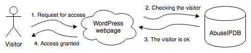
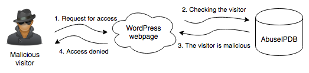

# LCC WP AbuseShield
LCC WP AbuseShield is a fork of mikasjp/wp-abuseshield. As of today (2023-01-12) the API referenced in the code is no longer being used by AbuseIPDB.com.
This repository will update mikasjp's implementation to use the current API at AbuseIPDB.com.

The original README.md is preserved below for context of the original developer.

## WP AbuseShield
WP AbuseShield is a WordPress plugin that helps protect your valuable website against many types of abuse on the Internet.

### How does it work?
The idea is very simple. The plugin checks the IP address of the new user in the AbuseIPDB via the API and checks if it has been reported in the last seven days. If IP is reported to AbuseIPDB, access is denied, otherwise access is granted.

---

### Features
* Protects against malicious bots
* Ability to verify the domain to increase the queries limits for AbuseIPDB

### Extra features
* Works well with CloudFlare
* Plugin has a cache to save limited queries to AbuseIPDB and improve performance
* Works without JavaScript

### Getting started
1. Install the plugin
2. Register an account on [AbuseIPDB](https://www.abuseipdb.com/) as a webmaster
3. Copy your API key to the plugin configuration panel
4. (Optional) Copy your Domain Verification Code (from meta tag) to the plugin configuration panel
5. That's all!

### Bug reporting
Feel free to open issues. Remember to describe your problem accurately!
